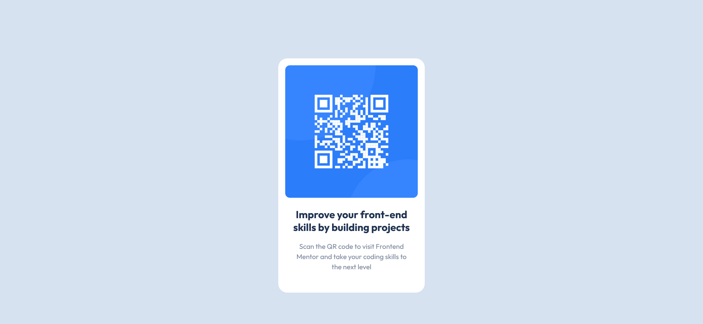

# Frontend Mentor - QR code component solution

This is a solution to the [QR code component challenge on Frontend Mentor](https://www.frontendmentor.io/challenges/qr-code-component-iux_sIO_H). Frontend Mentor challenges help you improve your coding skills by building realistic projects. 

## Table of contents

- [Overview](#overview)
  - [Screenshot](#screenshot)
  - [Links](#links)
- [My process](#my-process)
  - [Built with](#built-with)
  - [What I learned](#what-i-learned)
  - [Continued development](#continued-development)
  - [Useful resources](#useful-resources)
- [Author](#author)
- [Acknowledgments](#acknowledgments)

**Note: Delete this note and update the table of contents based on what sections you keep.**

## Overview

### Screenshot

### Links

- Solution URL: [Solution](https://www.frontendmentor.io/solutions/qr-code-component-PWHkSvK1os)
- Live Site URL: [Site](https://juanmartinrivas.github.io/qr-code-component-master/)

## My process

### Built with

- Semantic HTML5 markup
- Mobile-first workflow
- Parcel

### What I learned

After a short hiatus this project helped me get back to the basics of front-end development.

### Continued development

I plan to fix and rework any mistakes and imperfections that might be found and marked by the community.

## Author

- Frontend Mentor - [@JuanMartinRivas](https://www.frontendmentor.io/profile/JuanMartinRivas)
- Twitter - [@RivasJuanman](https://twitter.com/RivasJuanman)
- Linkedin - [@Juan Martin Rivas](https://www.linkedin.com/in/juan-mart%C3%ADn-rivas-b3253a1a8/)
- Github - [JuanMartinRivas](https://github.com/JuanMartinRivas)

## Acknowledgments

Big thanks to the people who made [Freecodecamp](https://www.freecodecamp.org) and [The Odin Project](https://www.theodinproject.com), I owe them everything I know about coding. Big thanks to [MDN](https://developer.mozilla.org) and [W3schools](https://www.w3schools.com) as well, for their useful articles on webdev. Finally a big thanks to anyone who helps me improve by giving me feedback on this project.